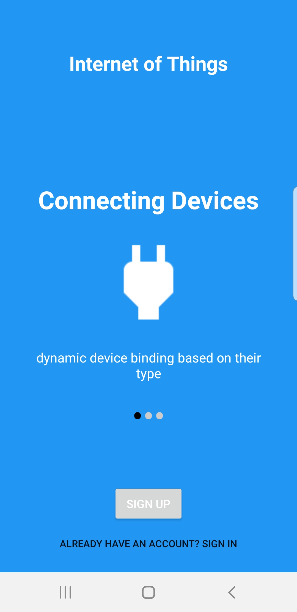
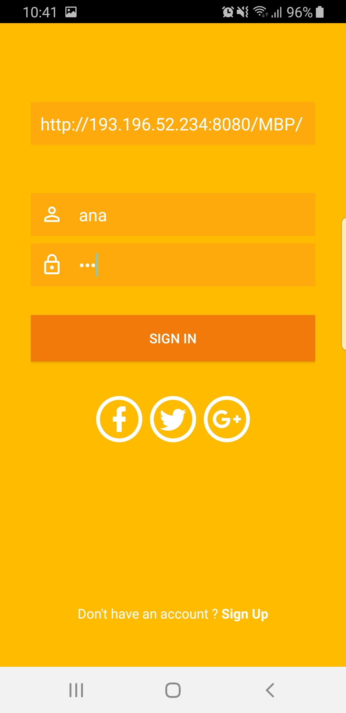
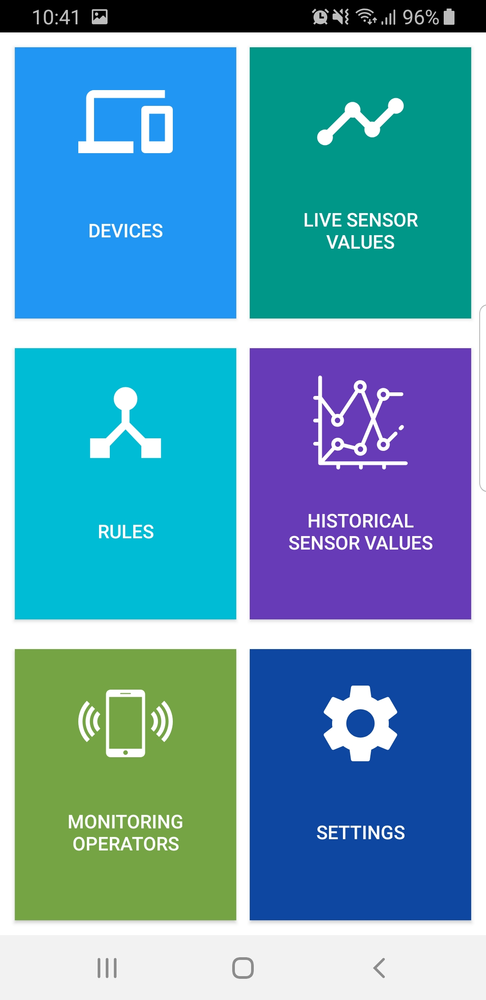
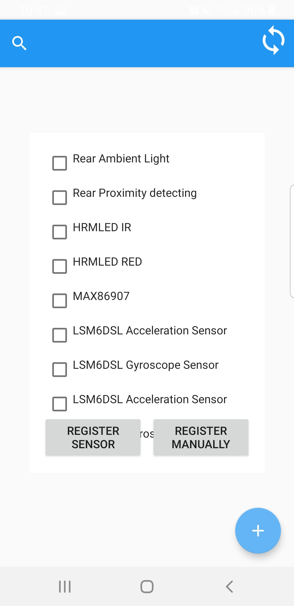
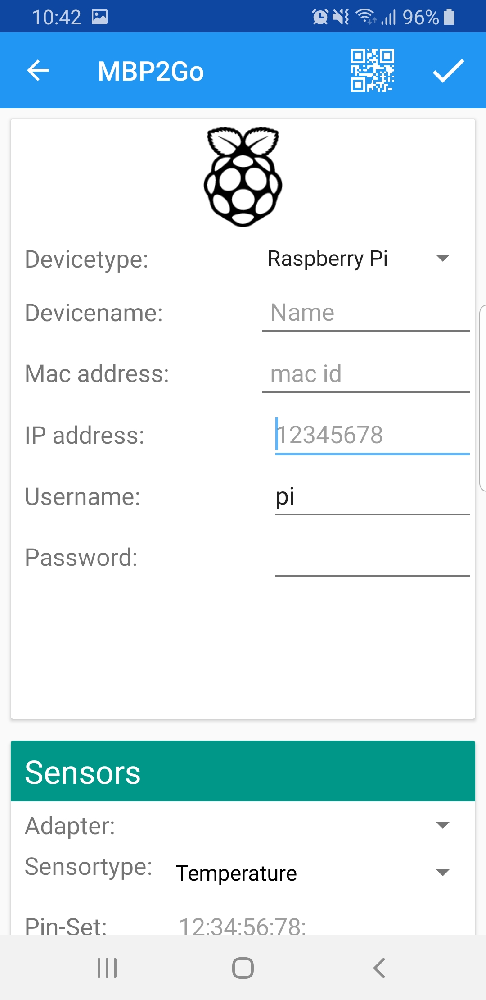
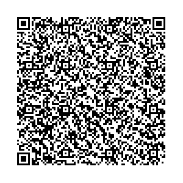

# MBP2Go
The **MBP2Go** is an android-based mobile client application for the [Multi-purpose Binding and Provisioning Platform (MBP)](https://github.com/IPVS-AS/MBP).

## Installation

For Developers:  
1. install Android Studio https://developer.android.com/studio/  
2. Download the project `MBP2Go` and open the directory `MBP2Go` in Android Studio.  

For Users:  
1. download the project `MBP2Go`.  
2. transfer the file `MBP2Go/MBP2Go/app/build/outputs/apkapp-debug.apk` to your smartphone. 
3. open this file in your smartphone - and have fun!

## Quick Start
1. connect to the **MBP**  

<div>



</div>

2. add a new device: `Devices > + > Register Manually > Press QR-Code Icon or fill in attributes`  

<div>


</div>

3. visualize sensor values: `Live Sensor Values > <Device>`  


### QR-Code Template Examples



```json
{  
   "type":"RaspberryPi",
   "name":"RaspberryPi",
   "macAddress":"b827eb8109a4",
   "ipAddress":"192.0.2.1",
   "user":"",
   "password":"",
   "sensors":[  
      {  
         "sensorname":"TemperatureSensor",
         "pinset":"A0",
         "sensoradapter":"temperature_stub",
         "sensortype":"Temperature"
      }
   ],
"actuators":[  
      {  
         "actuatorname":"SpeakerActuator",
         "pinset":"",
         "actuatoradapter":"speaker_computer",
         "actuatortype":"Speaker"
      }
   ]}
```

## Haftungsausschluss

Dies ist ein Forschungsprototyp.
Die Haftung für entgangenen Gewinn, Produktionsausfall, Betriebsunterbrechung, entgangene Nutzungen, Verlust von Daten und Informationen, Finanzierungsaufwendungen sowie sonstige Vermögens- und Folgeschäden ist, außer in Fällen von grober Fahrlässigkeit, Vorsatz und Personenschäden, ausgeschlossen.

## Disclaimer of Warranty

Unless required by applicable law or agreed to in writing, Licensor provides the Work (and each Contributor provides its Contributions) on an "AS IS" BASIS, WITHOUT WARRANTIES OR CONDITIONS OF ANY KIND, either express or implied, including, without limitation, any warranties or conditions of TITLE, NON-INFRINGEMENT, MERCHANTABILITY, or FITNESS FOR A PARTICULAR PURPOSE.
You are solely responsible for determining the appropriateness of using or redistributing the Work and assume any risks associated with Your exercise of permissions under this License.
